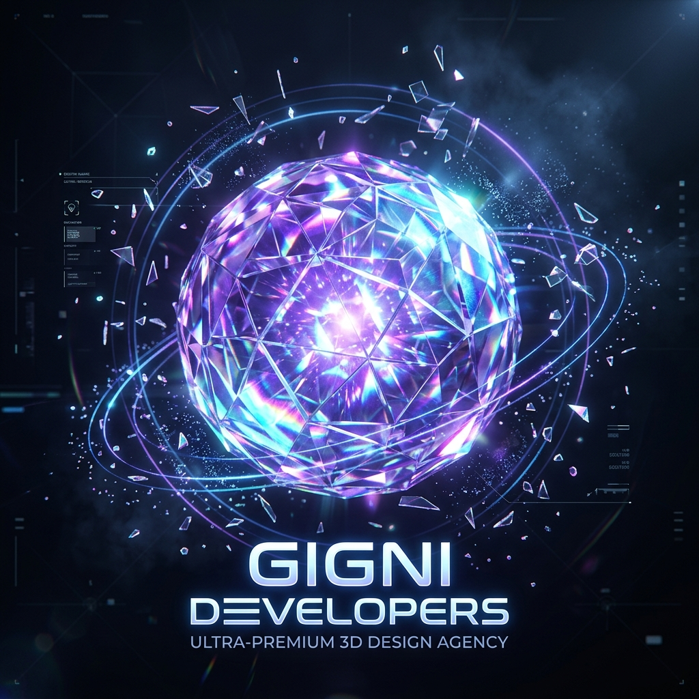

# Gigni Developers — Premium Website Design Studio

> An immersive 3D digital experience inspired by Noomo Agency storytelling design.



## ✨ Features

- **Three.js 3D Hero** — Real-time WebGL crystal orb with iridescence, orbital rings & particle field
- **Noomo-style Preloader** — Radial mask reveal animation with lavender gradient
- **Scrollytelling** — Scroll-driven narrative sections with sticky visuals
- **Custom Cursor** — Magnetic dot + trailing ring cursor
- **Glassmorphism Nav** — Frosted glass navigation with scroll-aware styling
- **Cinematic Typography** — DM Serif Display + Inter font pairing
- **Marquee Ticker** — Infinite scrolling services strip
- **Portfolio Grid** — Asymmetric 12-column work showcase
- **Testimonials Carousel** — Auto-scrolling client reviews
- **Dark Atmospheric Palette** — Deep blacks, lavender `#cebdf8`, ice blue

## 🚀 Deployment

This site is deployed on **Vercel** as a static site.

[](https://vercel.com/new/clone?repository-url=https://github.com/ankushkundapuraannaiah-bit/websited)

## 🛠 Tech Stack

| Layer | Technology |
|---|---|
| Core | HTML5, CSS3, Vanilla JS |
| 3D Rendering | Three.js (WebGL) |
| Fonts | Google Fonts — DM Serif Display, Inter |
| Deployment | Vercel (Static) |
| Version Control | GitHub |

## 📁 Project Structure

```
gigni-developers/
├── index.html        # Main website
├── hero_orb.png      # AI-generated 3D crystal orb
├── bg.png            # Dark nebula background
├── hologram.png      # Holographic UI visual
├── vercel.json       # Vercel deployment config
├── .gitignore
└── README.md
```

## 🎨 Design Credits

Website designed & developed by **Gigni Developers**.  
3D assets inspired by [Meshy.ai](https://meshy.ai).  
Design language inspired by [Noomo Agency](https://storytelling.noomoagency.com).

---

© 2025 Gigni Developers. All rights reserved.
